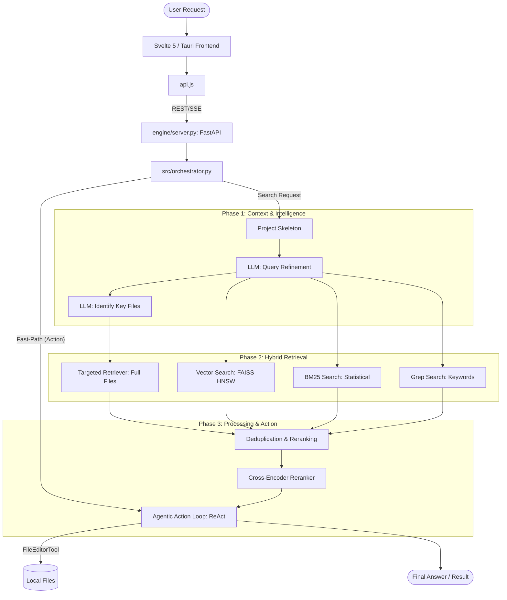

# Architecture: GitSurf Studio

This document outlines the high-level architecture and processing pipeline of GitSurf Studio.

## System Architecture

GitSurf Studio follows a **Thin Client, Smart Backend** architecture, separating the native desktop UI from the autonomous AI reasoning engine.

---

## Core Components

### 1. The Desktop Shell (`app/`)
- **Tauri**: Provides the native window and OS-level integration (File System, System Tray).
- **Svelte 5**: Handles the high-performance reactive UI using the new Runes API (`$state`, `$props`).
- **Monaco Editor**: A high-speed code editor for immediate file manipulation.

### 2. The AI Engine (`engine/server.py`)
A FastAPI wrapper around the PRAR pipeline that remains resident in memory for zero-latency interactions.

### 3. The PRAR Pipeline (`engine/src/orchestrator.py`)
Coordinates the "Perceive-Reason-Act-Reflect" loop:
- **Query Expansion**: LLM refines user question into technical intent.
- **Triple-Hybrid Search**: Parallel Vector + BM25 + Ripgrep search.
- **Cross-Encoder Reranking**: Verifies snippet relevance to prevent hallucinations.
- **Tool Use**: Autonomous execution of `FileEditorTool`, `SearchTool`, and `WebSearchTool`.

---

## Data Flow
1. **Discovery**: The tool reads the workspace structure via the `/files` endpoint.
2. **Focus**: The agent "targets" likely files using a Symbol MiniMap analysis.
3. **Retrieval**: Semantic and keyword matches are gathered in parallel.
4. **Action**: The agent decides whether to answer or take an action (like editing a file) based on the gathered context.
